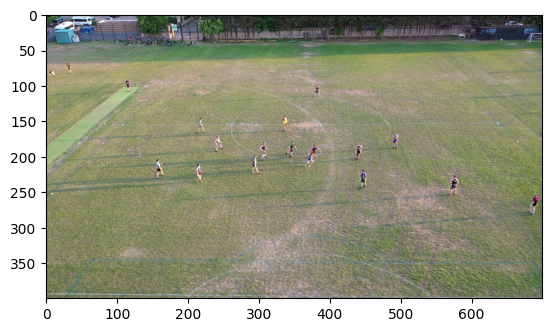
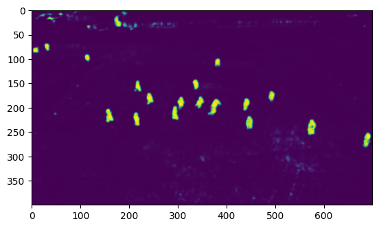
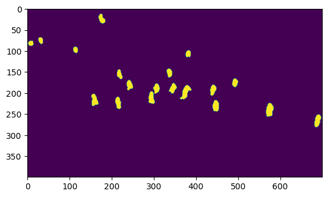
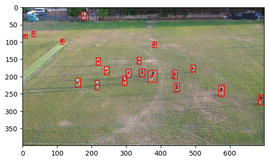

# stateful-object-tracking
Object tracking algorithm optimised for tracking objects like sports players were you know they are not going to suddenly disappeared from the frame.

## the problem 
with classic object tracking you always get this object flickering issue. as humans we know that even if you dont see it, you know it must be there because it was just there in the last frame. apply that logic to video tracking. 

## approach
online nearest neighbours to build up a dynamic visual ID, and in moments of confusion deploy a local serach using this visual id to persist tracking.
also use online learned physics metrics to narrow down the local search and accurately infere path of object when its not visable.

## Extra thought
- have the output from a model be a bitmap if you know that all of the objects your detecting are roughly the same size. ✅ this actually worked amazingly well
- - use a quilt inspired loss metric that will make the mask more learnable. 

## V1 results
with a simple image-2-image mask model with the blob bounding huristic trained on less than 15 full res images, the perfornace was amazing:

Test image:
---

Raw model output:
---

Cleaned up huristic output:
---

With blob bounding huristic:
---

